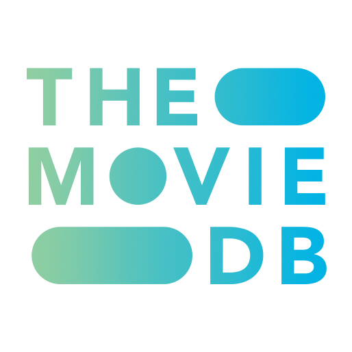

| <h1 style="padding-bottom:10px">My Movie Database</h1>
------------------------------ | ------------------------------

### Constructed in Python 3.9
 _Other packages utilized in this build_ 

|  Flask 1.1 | WTForms 2.3 | Flask-Bootstrap 3.3 | SQLAlchemy 2.4 | requests 2.25  |  Flask-WTF 0.14 
 -------- | --------- | -------- | --------- | -------- | --------

***
 

  

  

#### My Movie database

Pick any movie you can think of and place it on your list. The list is set up in a local database where you (and only you) can rate your movies and see them in your list.  

Your list will be displayed just like one of those internet top 10_ style countdown list, but without the popup adds. Your list can contain as many as you want and they are displayed in order from your lowest rated to your highest rated films.  

Change your mind about one move, no problem. You can adjust your rating or even delete the movie entirely. The choice is up to you.

This project was a class assignment in which I took extreme liberty in taking it further than necessary. However, my instructor Angela Yu ([@angelabauer](https://github.com/angelabauer)) provided the starter code templates and provided instruction during the course.

This is the first project for which I have not looked at Angela's completed code. Yet as I am putting this out in public, maybe that wasn't a good idea, 🤨 but it works! 😎

I hope you enjoy playing around with this little app as much as I enjoyed making it!

In order for the application to go online and get movie images and synopses, you will have to [get an api key.](https://www.themoviedb.org/signup) 

***

## Use and Directions:

> When the program starts, your default web browser will open revealing the user interface.  
> If you have your API key inserted, you can simply click on either  
>* the Add Movie button in the center of the screen
>* the Add Movie button from the header bar

***

  

### [_Get your API key_](https://www.themoviedb.org/signup)

  

  

    See Details
  

>1. Go to the link above and sign up for a free account.  
>2. Once account is confirmed ensure you are logged in to your account.  
>3. Hover the profile button (top right toolbar) and click settings.  
>4. In the menu bar to the left, click on API.  
>5. Fill in the form and request your key.  
>6. Once submitted, you should have immediate access to your key.  
>7. Copy your key and paste into the box found under the menu item labeled account > key storage  
>8. Once this key is saved into the application, you can load movie posters images, overviews, and release dates automatically when you search for a movie to add to your list.

  

 

***
## Installation:

#### With Python 3 using the console
>1. Download the movies folder.
>2. Place the folder into your python directory.
>3. Open the console app and type:  
`python3 /<path to your python directory>/movies/main.py`
   

***  

### With Pycharm  

_As this IDE was used for its creation, Pycharm will be more likely to function correctly if used._    

[_Taken directly from the Pycharm website_](https://www.jetbrains.com/help/pycharm/set-up-a-git-repository.html#put-existing-project-under-Git)

>1. From the main menu, select Git | Clone, or, if no project is currently opened, click Get from VCS on the Welcome screen.
>2. In the Get from Version Control dialog, specify the URL of the remote repository you want to clone, or select one of the VCS hosting services on the left.
>If you are already logged in to the selected hosting service, completion will suggest the list of available repositories that you can clone.
>3. Click Clone. If you want to create a project based on the sources you have cloned, click Yes in the confirmation dialog. Git root mapping will be automatically set to the project root directory.
>If your project contains submodules, they will also be cloned and automatically registered as project roots.
 

>### NOTE:
>>##### In addition to the API account, once downloaded, you will have to install additional modules found in the requirements.txt file.    Pycharm will alert you to the requirements at which time you may install those directly from the pycharm IDE.
   

***

### Other _similar to Pycharm_ integrated development environments (IDE)

Check the IDE creator's website for this specific information. The all the answers you need can be found in the IDE maker's Documentation, Stackoverflow, and Google.   
Here are a few different ways you may find this information to be labeled when you are searching.

>1. Check out a project from a remote host.
>2. Clone a project from GitHub.
>3. Download files into <your application> from a remote repository.

***
## Appreciations & Contributors

#### Angela Yu  ([@angelabauer](https://github.com/angelabauer))
_Much gratitude those of you whose packages include well written documentation and provide examples.  It really makes a huge difference to everyone when you care enough about your code to provide those things._

***
## Enjoy!

## License

>**[View the MIT License agreement](LICENSE.md)**

>#####     Copyright © 2021 Jim Bray and others,  &nbsp; All Rights Reserved
